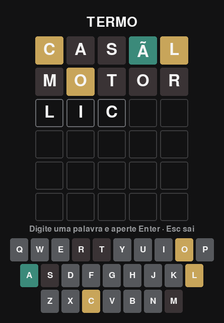

# Termo

Um joguinho pra descobrir a **palavra de 5 letras** em até 6 tentativas — o Termo, versão desktop.
Você chuta uma palavra e o jogo pinta cada letra:

- **verde**: letra certa, no lugar certo;
- **amarelo**: a letra existe na palavra, mas em outro lugar;
- **cinza**: essa letra não está na palavra.

Você digita sem acento e o jogo revela a acentuação quando você acerta a posição — `LICAO` acerta
`LIÇÃO`.



Este repositório é material didático da **39A**: o jogo já funciona, e a ideia é você usar o Claude
Code com o plugin `engenharia@39a` pra inventar features e modos novos em cima dele. **Não precisa
saber programar.**

> Veio pela aula? O roteiro completo, do setup ao primeiro pull request, está em
> **[docs/aula.md](docs/aula.md)**.

## O que precisa estar na sua máquina

Abra o **PowerShell** (tecla Windows, digite `powershell`, Enter) e instale o que faltar. Se você é
da 39A e já passou pelo `/setup-inicial` do plugin de engenharia, está tudo aí — pule para
[Como rodar](#como-rodar).

| Ferramenta      | Para quê                                        | Como instalar                                                |
| --------------- | ----------------------------------------------- | ------------------------------------------------------------ |
| **Git**         | baixar o jogo e guardar o que você mudar        | `winget install --id Git.Git -e`                             |
| **uv**          | baixa o Python e as bibliotecas sozinho         | `winget install --id astral-sh.uv -e`                        |
| **Claude Code** | o app onde você trabalha, com terminal dentro   | [claude.com/claude-code](https://claude.com/claude-code)      |
| **GitHub CLI**  | abrir o pedido de merge, lá no fim              | `winget install --id GitHub.cli -e`                           |

**Feche e abra o PowerShell depois de instalar.** Senão ele não encontra os comandos novos — é o
tropeço número um aqui.

> Se o `winget` não funcionar na sua máquina, o uv também instala assim:
> `powershell -ExecutionPolicy ByPass -c "irm https://astral.sh/uv/install.ps1 | iex"`
>
> **Mac?** `brew install git gh uv` resolve as três primeiras; depois abra o Terminal e siga igual.

## Como rodar

1. **Faça o seu fork.** Abra <https://github.com/39A-net-br/termo-game> e clique em **Fork**, no
   canto superior direito. Você fica com uma cópia do jogo na sua conta, onde pode mexer à vontade
   sem atrapalhar ninguém.

2. Baixe o **seu** fork e entre na pasta (troque `<seu-usuario>` pelo seu usuário do GitHub):

   ```powershell
   git clone https://github.com/<seu-usuario>/termo-game
   cd termo-game
   ```

3. Prepare o ambiente (baixa o Python 3.12 e as bibliotecas — só precisa fazer uma vez):

   ```powershell
   uv sync
   ```

4. Jogue:

   ```powershell
   uv run termo
   ```

## Como jogar

- **Digite** uma palavra de 5 letras e aperte **Enter**.
- **Backspace** apaga a última letra. Acento você não precisa digitar.
- O teclado embaixo da grade vai colorindo as letras que você já usou.
- Acertou, ou gastou as 6 tentativas? **R** começa outra partida. **Esc** fecha o jogo.

## Comandos úteis

| Quero…                          | Comando                        |
| ------------------------------- | ------------------------------ |
| Jogar                           | `uv run termo`                 |
| Rodar os testes automáticos     | `uv run pytest`                |
| Checar a qualidade do código    | `uv run ruff check .`          |
| Arrumar a formatação do código  | `uv run ruff format .`         |

## Como o projeto é organizado

```
src/termo/palavras.py     a lista de palavras, o sorteio e a regra de tirar o acento
src/termo/jogo.py         as regras: que letra é verde, amarela ou cinza, e quando a partida acaba
src/termo/gui.py          a parte visual: desenha a grade e o teclado, e reage às teclas
src/termo/palavras.txt    as palavras do jogo — dá pra acrescentar as suas
src/termo/__main__.py     o "botão de ligar" do jogo
tests/                    testes automáticos: avisam quando algo quebra e explicam por que cada regra existe
docs/aula.md              o guia da aula: do setup ao primeiro pull request, passo a passo
CLAUDE.md                 o manual que o Claude Code lê antes de mexer neste projeto
DECISOES.md               o diário do projeto: o que foi decidido, por quê, e qual teste protege
IDEIAS.md                 lista de features pra você escolher e vibe codar
```

## Hora de vibe codar

**1. Instale o plugin de engenharia da 39A** (uma vez só, na sua máquina). É ele que ensina ao Claude
como a casa trabalha — e usá-lo é metade do que se aprende aqui:

```
/plugin marketplace add 39A-net-br/claude-plugins-39a
```

```
/plugin install engenharia@39a
```

Feche e abra o Claude Code. O marketplace é privado: precisa da sua conta do GitHub na 39A. Sem ele
o jogo funciona igual, só sem os atalhos.

**2. Abra a pasta do projeto no Claude Code.** A conversa e o terminal ficam ali dentro.

**3. Escolha uma ideia no [IDEIAS.md](IDEIAS.md)** — ou invente a sua. Peça em português, do seu
jeito. Exemplos pra copiar e colar:

- "Mostre 'Faltam 3 tentativas' embaixo do título."
- "Troque as cores do jogo pra um tema claro, com fundo branco."
- "Quando eu terminar, copie pro Ctrl+V um resuminho em quadradinhos coloridos, como o Termo faz."

**4. Rode `uv run termo` pra ver o resultado.** Não gostou? Diga pro Claude o que mudar. Ele não
enxerga a sua tela — descreva o que apareceu.

**5. Terminou uma feature?** Digite `/revisar`: o Claude revisa o próprio trabalho como um
programador experiente faria e conta o que encontrou. Antes de commitar, `/verificar` roda os testes
e a checagem de código.

**6. Guarde o seu trabalho** com o mesmo fluxo que a 39A usa nos projetos de verdade — o Claude
conduz, é só pedir:

```powershell
git checkout -b feature/20260917-minha-primeira-feature
```

```powershell
git push -u origin feature/20260917-minha-primeira-feature
```

```powershell
gh pr create --base main --repo <seu-usuario>/termo-game
```

O `--repo` é importante: sem ele, o GitHub tenta abrir o pedido no repositório da 39A em vez do seu
fork. Depois é só abrir o link, olhar o que mudou e clicar em **Merge** — a revisão é sua.

Dica de ouro: **uma coisa de cada vez**. Pedidos pequenos dão certo muito mais vezes que pedidos
gigantes.

**Por que tanto teste?** Como ninguém aqui vai ler o código, os testes são quem lembra por que cada
regra existe e avisa quando algo quebra. O Claude Code é instruído a escrever um teste pra cada
comportamento novo e a anotar decisões no `DECISOES.md` — deixe ele fazer isso, mesmo que pareça
"trabalho extra". É o que permite você mexer no projeto por semanas sem ele virar uma bagunça.

## Deu problema?

| O que aconteceu                            | O que fazer                                                                                       |
| ------------------------------------------ | ------------------------------------------------------------------------------------------------- |
| `git` não é reconhecido como comando       | Falta instalar o Git (tabela lá em cima) — e depois fechar e abrir o PowerShell.                  |
| `uv` não é reconhecido como comando        | Feche e abra o PowerShell de novo. Se continuar, instale o uv outra vez.                          |
| `gh` não é reconhecido como comando        | É o GitHub CLI, e só faz falta no passo do pedido de merge. Instale e reabra o PowerShell.        |
| `uv sync` falha ao baixar coisas           | Pode ser proxy ou antivírus da empresa — chame o TI ou tente pela rede do celular.                |
| A janela abre e fecha na hora              | Rode de novo e copie a mensagem de erro pro Claude Code. Ele resolve.                             |
| Erro falando de `pygame`                   | O projeto usa `pygame-ce`. Se alguém instalou o `pygame` junto, rode `uv sync --reinstall`.       |
| `/plugin marketplace add` reclama de login | Rode `gh auth login` e `gh auth setup-git` uma vez, e tente de novo.                              |
| Travou tudo e não sei o que fazer          | `uv sync --reinstall` e tente de novo. Se não resolver, peça ajuda — é pra isso que estamos aqui. |
